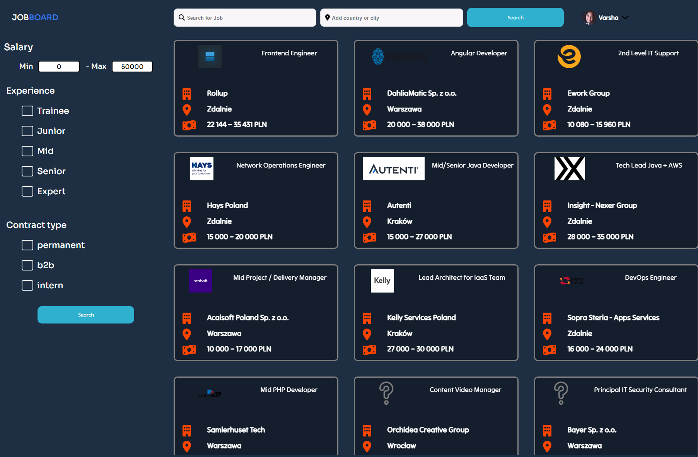
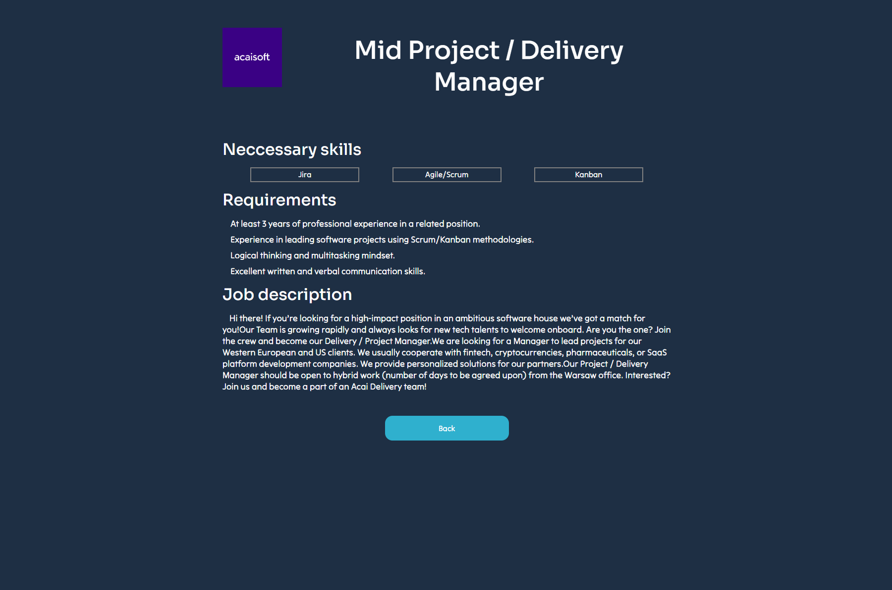

# Job board
This application is symulation of job board with offers from IT trade. It is based on offers from https://nofluffjobs.com/pl  
It contains also detailed information about job offers and small simulation of user which is logged in. Offers can be filtred   with special filters by location, 
job name, experience level and contract type criterias. Site is fully responsive
Here is a repository with backend project https://github.com/PiotrO9/job_board_scrapper
## Tech stack
For Frontend I used Vue.js 3 framework. App is styled with scss. My Backend is using Node.js and Express.js for base functions.  
Scraping datas is possible by Puppeteer.js library. Api which I am using are https://randomuser.me/ and my own scrapping idea  
for scrapping datas from https://nofluffjobs.com/pl. I aplied BEM naming convention for elements in site and folder structure.  
Application is tested with Jest framework for unit tests and Cypress framework for e2e tests. Fonts which I am using come from google  
fonts, icons and svgs are from https://fontawesome.com/
## How to use it?
1) git clone https://github.com/PiotrO9/job_board.git
2) npm install
3) npm run serve
### Important information
Because of there is no free hosting where host app with puppeteer.js (Backend) library is possible, to run whole project you have to   download backend
and frontend locally  
Backend repository https://github.com/PiotrO9/job_board_scrapper

